# ToolDevelopmentリポジトリについて

## 目次
- [概要](#概要)
- [制作背景](#制作背景)
- [制作したツール](#制作したツール)
  - [SchemaImporter](#SchemaImporter)
  - [SceneLauncher](#SceneLauncher)
  - [UITools](#UITools)
  - [AttachedComponentsChecker](#AttachedComponentsChecker)
  - [ObjectRenamer](#ObjectRenamer)

## 概要
2025年の10月頃から始めたツール制作をまとめたリポジトリです。

## 制作背景
チーム制作をしている中でEditor拡張の存在を知り、チーム開発での必要性を感じ制作に至りました。

## 制作したツール
*一部を抜粋して紹介

### *・SchemaImporter*<br>
GoogleスプレッドシートやCSVファイルをもとに、ScriptableObjectクラスとデータアセットを自動生成し、データ管理を効率化するEditor拡張ツール<br>
【目的】<br>
以前よりプランナーの作る仕様をScriptableObjectに落とし込む作業に手間を感じ、作業時間短縮のために制作<br>
また、以前に作っていたScriptableObjectクラス生成ツール
（Assets/Editorフォルダ内[GssDownloadAndCsvConert.cs](ToolDevelopment/Assets/Editor/GssDownloadAndCsvConert.cs)）を改良する目的で製作開始<br>
【使用方法】<br>
1. ツールウィンドウ上部にある入力設定プルダウンから生成元の形式を選択<br>
　 (現在はCSVファイルとGoogleスプレッドシート(GSS)のみ対応) <br>
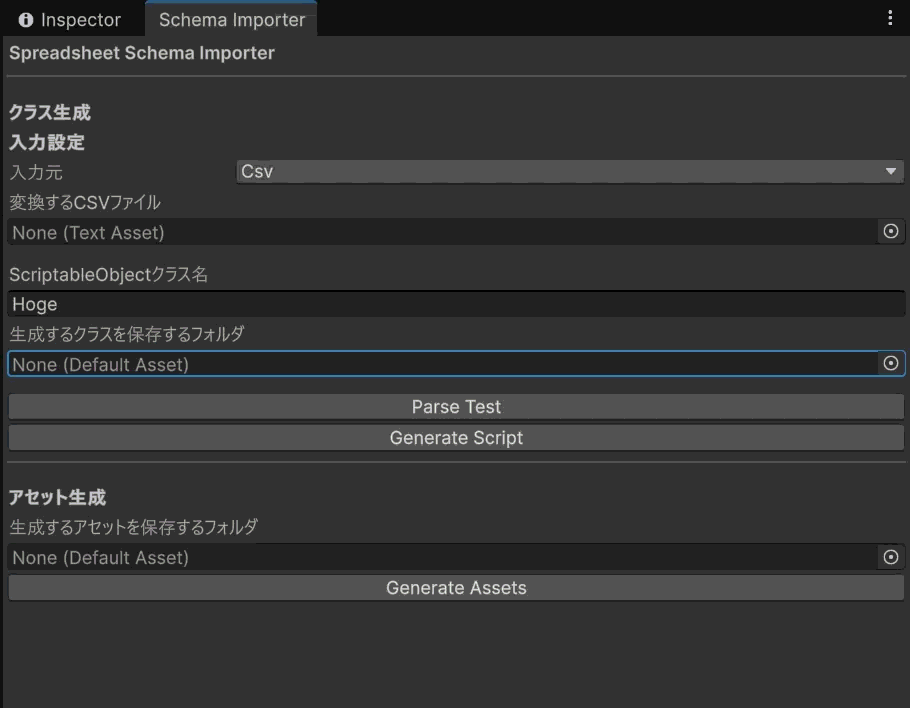<br>
2. 各入力元での設定
<table>
<tr>
<td width="50%">

CSVから<br>
2-1. 変換するCSVファイルをフィールドに設定<br>
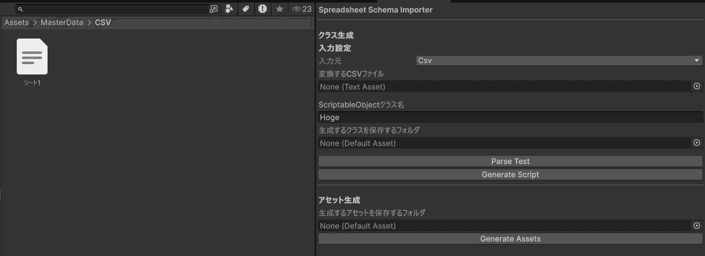

</td>
<td width="50%">

GSSから<br>
2-1. GoogleスプレッドシートのシートIDを入力<br>

2-2. シートGIDを入力


</td>
</tr>
</table>

3. 生成するScriptableObjectクラスの名前を入力<br>
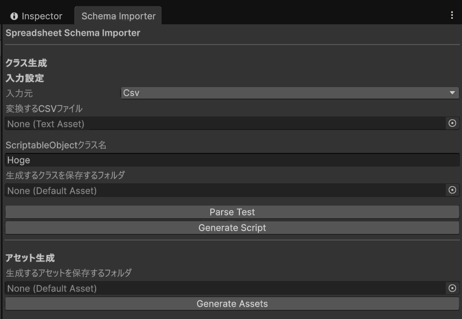<br><br>
4. 生成するクラスを保存するフォルダを設定<br>
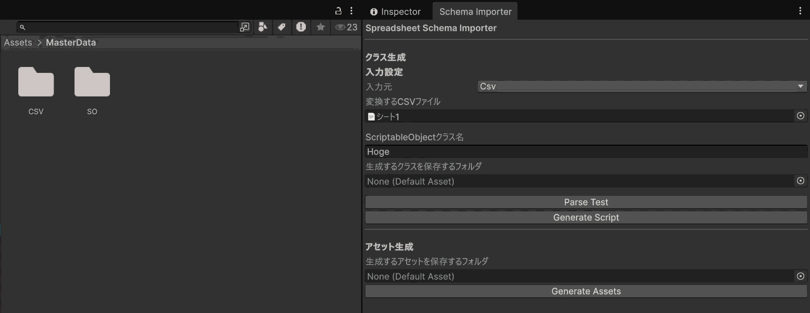<br><br>
5. GenerateScriptのボタンを押してクラスを生成(生成前にParseTestで変換可能かを見ると安全)<br>
<table>
<tr>
<td width="50%">
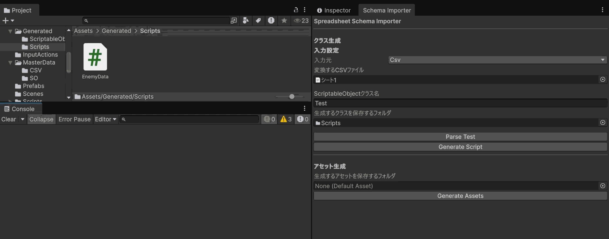
</td>
<td width="50%">
*シートの中身
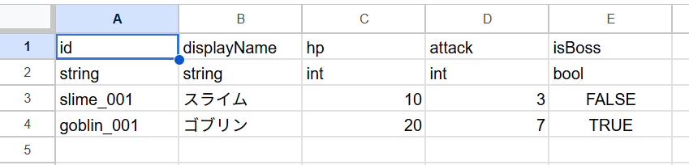
</td>
</tr>
</table>

6. 生成するアセットを保存するフォルダを設定<br>
   4.の方法と同じように<br><br>
7. GenerateAssetsボタンを押してアセットを生成<br>
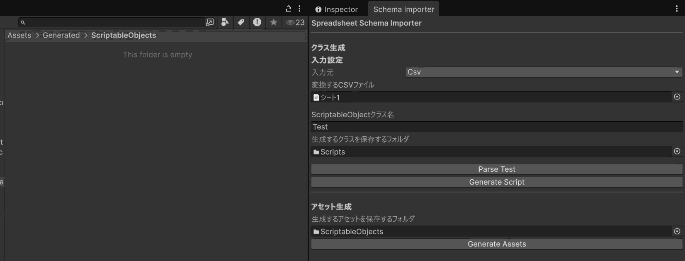<br>


### *・SceneLauncher*<br>
【目的】<br>
Editor上でゲームの流れなど動作確認する際にシーンアセットを探す手間や、BuildSettingsへシーンアセットを登録する時の手間などを省くために制作<br>
また、以前制作していたSceneListWindow
（Assets/Editorフォルダ内[SceneListWindow.cs](ToolDevelopment/Assets/Editor/SceneListWindow.cs)）を改良する目的もあり<br>

【使用方法】<br>
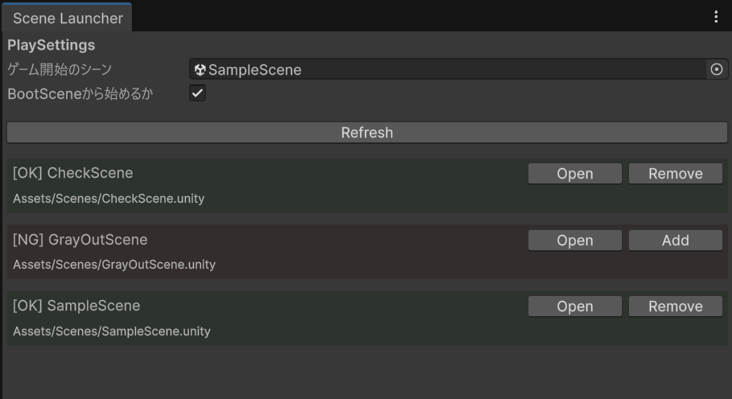
1. プレイ時の開始シーン登録<br>
・シーンアセットをドラッグアンドドロップでセット可能<br>
・チェックボックスでBootSceneから始めるか切り替え可能<br>

1. BuildSettingsへの登録
ウィンドウ下部分のシーン一覧の各シーンの右側ボタンから登録、解除が可能<br>
・登録時<br>
  赤く表示されているシーンが未登録のシーンで、Addボタンを押すと登録される<br>
・解除時<br>
  Removeボタンを押すと解除される<br>
また、登録、解除ボタンの隣にあるOpenボタンでアクティブシーンの切り替えが可能<br><br>


### *・UITools*<br>
エディタにインポートした画像を自動でUI用に変換するツール<br>

【構成】<br>
UITools<br>
├ [UIFolderInitializer.cs](ToolDevelopment/Assets/Editor/UIFolderInitializer.cs)<br>
└ [UITextureAutoImpoter.cs](ToolDevelopment/Assets/Editor/UITextureAutoImpoter.cs)<br>
【目的】<br>
インポートした画像をUI用に設定する手間の削減のため<br>
【ツールが行うこと】
- UIFolderInitializer.cs<br>
  Assetsフォルダに<br>
  UI<br>
  ├ BackGround<br>
  ├ Button<br>
  └ Icon<br>
  のフォルダ構成でフォルダを作成する<br>
- UITextureAutoImporter.cs<br>
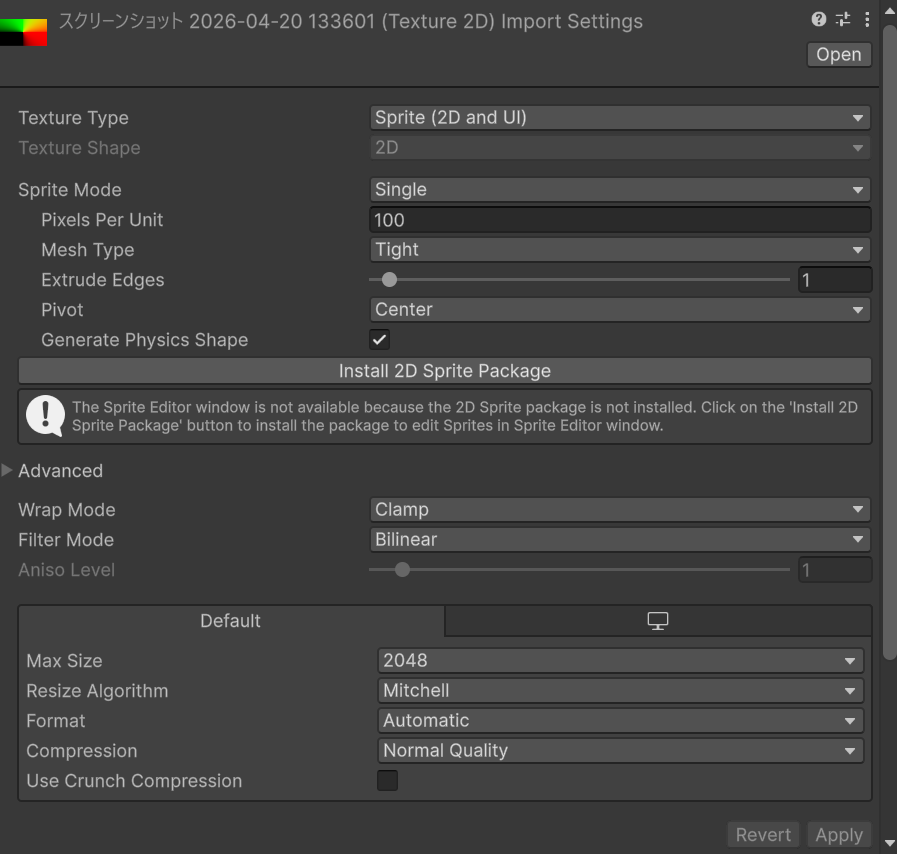<br>
エディタにインポートした画像をUI用に設定を変更する
ApplyBaseUISettingsメソッドで共通する設定を変更<br>
```csharp
    private void ApplyBaseUISettings(TextureImporter importer)
    {
        // Texture Type : Sprite (2D and UI)に変換
        importer.textureType = TextureImporterType.Sprite;
        // SpriteModeをSingleに設定
        importer.spriteImportMode = SpriteImportMode.Single;
        // UIでは不要なためMipMapを無効化
        importer.mipmapEnabled = false;
        // PNGの透明部分を適切に扱うようにする
        importer.alphaIsTransparency = true;
        // 拡大縮小時に滑らかに補間する
        importer.filterMode = UnityEngine.FilterMode.Bilinear;
        // 圧縮
        importer.textureCompression = TextureImporterCompression.Compressed;
    }
```
共通部分変更後フォルダに合わせてテクスチャサイズを変更<br>

|フォルダ名|最大テクスチャサイズ|
|---|---|
|BackGround|2048|
|Button|1024|
|Icon|512|

<br>


### *・AttachedComponentsChecker*<br>
【目的】<br>
どのコンポーネントがアタッチされているかを視認しやすくし多重アタッチを防ぐ<br>
【設計意図】<br>
使用頻度の高いコンポーネントを対象に視覚的に判別できる仕組みを実装<br>
過剰な表示による視認性の低下を防ぐために主要コンポーネントに限定<br>
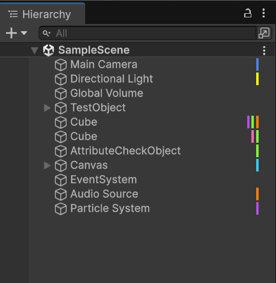

|色|コンポーネント|
|---|---|
|💙|カメラ|
|💛|ライト|
|💚|物理系（Rigidbody/Collider）|
|🩵|キャンバス|
|🧡|オーディオ系（AudioSource/AudioClip）|
|💜|パーティクル|
|🩷|アニメーター|

<br>


### *・ObjectRenamer*<br>
選択したオブジェクトの語尾につく(1)を自動削除するツール
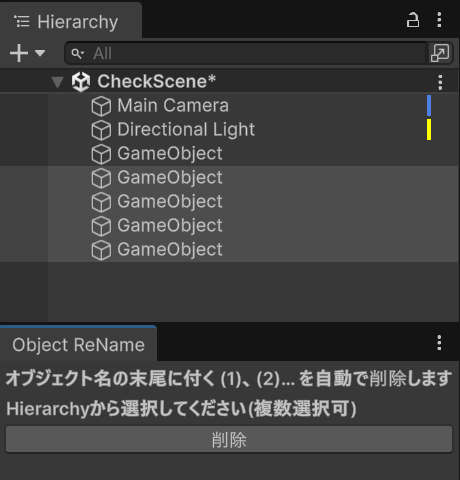
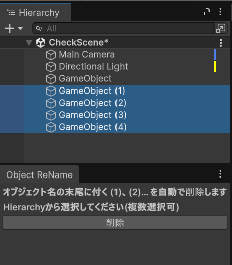

【目的】<br>
複製時の名前の煩雑になる問題を防ぐ<br><br>
【設計意図】<br>
作業の手間の削減とヒューマンエラー防止のため